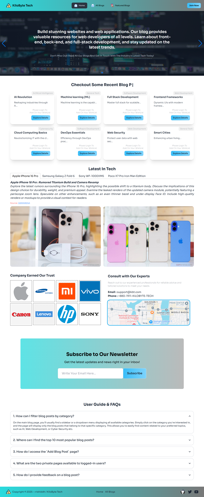

#  KiloByte Tech✨

## Project Name: KiloByte Tech

### A brief description: 
- KiloByte Tech is a user-focused technology blog platform. The goal of this project is to create a space where tech enthusiasts can explore, read, and share insights about the latest gadgets, software, and trends in the tech industry. Key features include user authentication, blog creation, and an interactive comment system to foster engagement. The platform boasts a clean, responsive UI with a focus on simplicity and functionality, delivering a seamless and informative browsing experience.  

---

### Purpose:

- The purpose of KiloByte Tech is to deliver an engaging, insightful, and visually captivating platform for technology enthusiasts to explore the latest innovations, trends, and reviews in the tech world. It is built using modern web technologies, ensuring seamless navigation, fast performance, and an interactive user experience.
  

### Main Key Features:

- Backend Database Handling: Implement robust CRUD operations on the backend database to manage user data, reviews, and other relevant information. Integrate these operations seamlessly into the frontend to ensure data persistence and synchronization. 
- User Authentication: Secure user registration and login using Firebase Authentication, with options for email/password and Google sign-in
- Use Of JWT(JSON Web Token): JWT (JSON Web Token) is an open standard for securely transmitting information between two parties as a JSON object, commonly used for user authentication and authorization.
- Dynamic Navigation: Context API ensure count and other elements update (specially reviews) in real time.
- React Routing: Smooth navigation between pages with protected and public route handling.
- Product Management: Display products dynamically with sorting and filtering options for an optimized shopping experience.

### NPM Packages I've Used First Time:
- Tanstack/React-Table: Tanstack/React-Table is a powerful and flexible data table library for React. It provides a robust and customizable foundation for building interactive and performant data tables with features like sorting, filtering, pagination, and more.
- Axios: Axios is a popular promise-based HTTP client for the browser and Node.js. It simplifies making HTTP requests, such as GET, POST, PUT, and DELETE, and handles JSON responses automatically.
- Framer-Motion: Framer-Motion is an animation library for React that provides a declarative and performant way to create stunning motion effects for your components. It offers features like spring physics, gesture interactions, and layout animations.
- React-Photo-View: React-Photo-View is a lightweight and easy-to-use React component for displaying high-resolution images in a lightbox or modal. It supports zooming, panning, and various customization options.
- React-Loading-Skeleton: React-Loading-Skeleton is a simple and effective library for creating skeleton loaders, which provide visual feedback to users while data is being loaded. It helps improve the user experience by showing a placeholder representation of the content before it becomes available.
- React-Tabs: React-Tabs is a simple and accessible React component for creating tabbed interfaces. It provides a straightforward API for managing tab selection and content visibility.
- Swiper: Swiper is a free and open-source JavaScript library for creating touch-enabled sliders and carousels. It is highly customizable and supports various features like autoplay, loop, and lazy loading.

### Dependencies:
- @tanstack/react-table: ^8.20.6
- axios: ^1.7.9
- firebase: ^11.1.0
- framer-motion: ^11.15.0
- localforage: ^1.10.0
- match-sorter: ^8.0.0
- motion: ^11.15.0
- react: ^18.3.1
- react-dom: ^18.3.1
- react-loading-skeleton: ^3.5.0
- react-photo-view: ^1.2.6
- react-router-dom: ^7.1.0
- react-tabs: ^6.1.0
- react-toastify: ^11.0.2
- sort-by: ^1.2.0
- sweetalert2: ^11.15.3
- swiper: ^11.1.15

### How to run on local machine?
1. Open your terminal or command prompt.

2. Use the git clone command followed by the repository URL:-  git clone 'repository-url'

- Replace 'repository-url' with the actual URL of the Git repository you want to clone.

3. To run the project: Navigate to the project directory:- cd 'directory-name' 

4. Run 'npm install' to install project dependencies.

5. Environment setup:Create a '.env.local' file and put your firebase environment variable there. Save the following variable:
- VITE_apiKey='YOUR_FIREBASE_API_KEY'
- VITE_authDomain='YOUR_FIREBASE_AUTH_DOMAIN'
- VITE_projectId='YOUR_FIREBASE_PROJECT_ID'
- VITE_storageBucket='YOUR_FIREBASE_STORAGE_BUCKET'
- VITE_messagingSenderId='YOUR_FIREBASE_MESSAGING_SENDER_ID'
- VITE_appId='YOUR_FIREBASE_APP_ID'

6. Run 'npm run dev' to run the project locally.

##  Live Link: 
### Surge : [KiloByte Tech](https://kilobyte-tech-rrishiddh.surge.sh/)

### 
##  GitHub Repo Link: 
###  Server Side : [https://github.com/rrishiddh/KiloByte-Tech-Server](https://github.com/rrishiddh/KiloByte-Tech-Server)

##  Site Preview: 
 

  
   
  
   
  
   
  
   
  

### 

